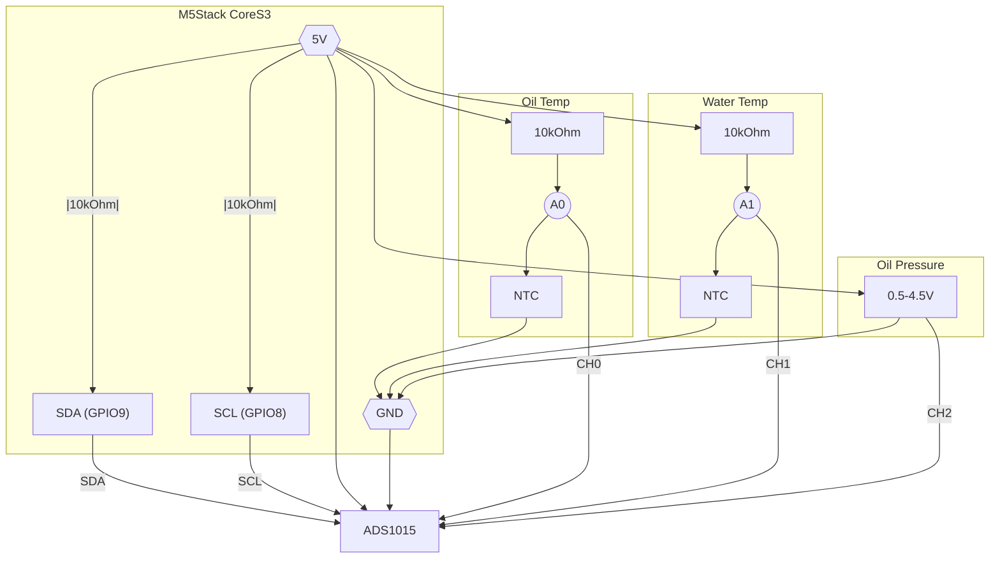

# M5Stack CoreS3 Multi-Gauge  
# M5Stack CoreS3 マルチメーター

A compact digital dashboard driven by **M5Stack CoreS3 + ADS1015** that displays:

* **Oil Pressure** via **Defi PDF00903S** (0 – 9.9 bar, 0.5 – 4.5 V)
* **Oil / Water Temperature** via **Defi PDF00703S** (–40 – 150 °C, 0.5 – 4.5 V)  

---

## 📘 日本語 README

### 概要
このプロジェクトは、**M5Stack CoreS3** と **ADS1015** ADC を用いて、Defi 製センサ **PDF00903S**・**PDF00703S** を表示する車載用マルチメーターです。
サーキットでの簡易モニタリング用途に最適化しています。

### 主な機能
- 油圧 (0–9.9 bar) 半円アナログメーター
  - 本リポジトリでは **油圧**・**水温**・**油温** を表示
- 油温 / 水温 (–40–150 °C) デジタル数値＋バー表示  
- 各種設定は `include/config.h` の定数で変更可能
- 水温・油温は500ms間隔で取得し、10サンプル平均を5秒ごとに更新
- 周囲光センサーによりバックライトを自動調整

### ハードウェア構成
| モジュール       | 型番 / 仕様                       | 備考 |
|------------------|----------------------------------|-------------------------|
| MCU              | **M5Stack CoreS3** (ESP32-S3)    | USB-C, 2.0インチ IPS LCD |
| ADC              | **ADS1015** 12bit / I²C / 4ch     | アナログ入力 |
| 圧力センサ       | **PDF00903S** (Defi)              | CH0 / 0.5 – 4.5 V |
| 温度センサ1      | **PDF00703S** (Defi)              | CH1 / 0.5 – 4.5 V |
| 温度センサ2      | **PDF00703S** (Defi)              | CH2 / 0.5 – 4.5 V |
| 電源             | 5V                               | CoreS3 USB経由 または 5Vピン |

> 💡 5Vピンは入力(給電)と外部機器への出力の両方に利用できます。`M5.Power.setExtOutput(true)`で出力を有効化した状態では、外部から同時に給電しないでください。
> 5Vピンから給電する場合は `M5.Power.setExtOutput(false)` として出力を無効にします。

### 配線図 / Wiring Diagram

### センサー対応表

油圧センサは電圧出力式のため抵抗値はありません。参考として油圧と出力電圧の関係を下表に示します。

| 油圧 [bar] | 電圧 [V] |
|-----------|---------|
| 0 | 0.50 |
| 1 | 0.90 |
| 2 | 1.30 |
| 3 | 1.70 |
| 4 | 2.10 |
| 5 | 2.50 |
| 6 | 2.90 |
| 7 | 3.30 |
| 8 | 3.70 |
| 9 | 4.10 |
| 10 | 4.50 |

温度センサ（サーミスタ）の抵抗値は以下の通りです。

| 温度 [°C] | 抵抗値 [Ω] |
|-----------|-----------|
| 0 | 28223.73 |
| 10 | 18231.40 |
| 20 | 12133.17 |
| 30 | 8294.61 |
| 40 | 5809.87 |
| 50 | 4160.14 |
| 60 | 3039.19 |
| 70 | 2261.28 |
| 80 | 1710.89 |
| 90 | 1314.50 |
| 100 | 1024.32 |
| 110 | 808.66 |
| 120 | 646.12 |

### ビルド方法
1. [PlatformIO](https://platformio.org/) をインストール (VS Code 推奨)
2. `platformio run` でビルドし、`platformio upload` で書き込み

---

## English README

### Overview
This project turns an **M5Stack CoreS3** and **ADS1015 ADC** into a simple yet powerful multi-gauge that reads:

- **Oil Pressure** using **Defi PDF00903S** (0.5–4.5 V, 0–9.9 bar)
- **Oil / Water Temperature** using **Defi PDF00703S** (0.5–4.5 V, –40 to 150°C)  

Perfect for vintage cars lacking modern instrumentation or for lightweight track-day data monitoring.

### Features
- Semi-circular analog gauge (0–9.9 bar, pressure)
  - In this repository, **oil pressure**, **water temperature**, and **oil temperature** are implemented.
- Digital + bar graph temperature display
- Most settings are in `include/config.h`
- Water and oil temperatures are sampled every 500 ms and averaged over 10 samples (updated every 5 seconds)
- Automatic backlight brightness using the ambient light sensor

### Hardware Configuration
| Module           | Part / Spec                    | Notes                   |
|------------------|-------------------------------|-------------------------|
| MCU              | **M5Stack CoreS3** (ESP32-S3)  | 2.0" IPS, USB-C         |
| ADC              | **ADS1015** 12-bit, I²C, 4ch    | Analog signal input     |
| Pressure Sensor  | **PDF00903S** (Defi)           | CH0, 0.5–4.5V           |
| Temp Sensor 1    | **PDF00703S** (Defi)           | CH1, 0.5–4.5V           |
| Temp Sensor 2    | **PDF00703S** (Defi)           | CH2, 0.5–4.5V           |
| Power Supply     | 5V                             | Powered via USB or 5V pin         |

> 💡 The 5V pin can power the CoreS3 or supply external devices. When `M5.Power.setExtOutput(true)` is active, avoid feeding power from another 5V source at the same time.
> To run from the 5V pin, keep `M5.Power.setExtOutput(false)` so the pin won't output power.

> 📌 Detailed wiring diagrams will be added soon.

### Sensor Tables

The pressure sensor outputs only voltage; the mapping between pressure and output voltage is below.

| Pressure [bar] | Voltage [V] |
|----------------|-------------|
| 0 | 0.50 |
| 1 | 0.90 |
| 2 | 1.30 |
| 3 | 1.70 |
| 4 | 2.10 |
| 5 | 2.50 |
| 6 | 2.90 |
| 7 | 3.30 |
| 8 | 3.70 |
| 9 | 4.10 |
| 10 | 4.50 |

The temperature sensor is a thermistor; typical resistance values are shown below.

| Temperature [°C] | Resistance [Ω] |
|------------------|---------------|
| 0 | 28223.73 |
| 10 | 18231.40 |
| 20 | 12133.17 |
| 30 | 8294.61 |
| 40 | 5809.87 |
| 50 | 4160.14 |
| 60 | 3039.19 |
| 70 | 2261.28 |
| 80 | 1710.89 |
| 90 | 1314.50 |
| 100 | 1024.32 |
| 110 | 808.66 |
| 120 | 646.12 |

### Build Instructions
1. Install [PlatformIO](https://platformio.org/) (VS Code recommended)
2. Build with `platformio run` and flash with `platformio upload`

---

### License
このプロジェクトは MIT ライセンスではありません。著作権は作者が保持します。
This project is not licensed under the MIT License. All rights reserved by the author.

---

🚗 Built for performance, track use, and hobbyist tuning.
