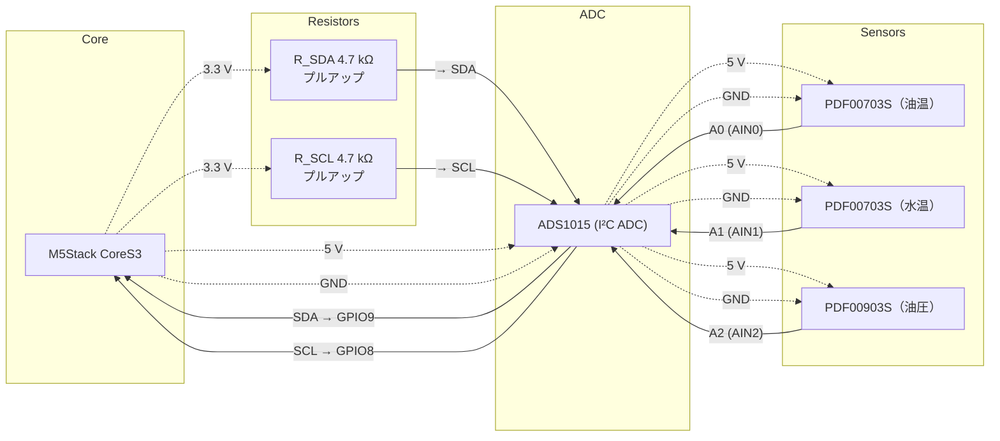

## M5Stack CoreS3 × 油圧・水温・油温センサ 配線図

```mermaid
graph LR
    %% ===== Devices =====
    subgraph Core
        CoreS3["M5Stack CoreS3"]
    end

    subgraph ADC
        ADS1015["ADS1015 (I²C ADC)"]
    end

    subgraph Sensors
        OilTemp["PDF00703S（油温）"]
        WaterTemp["PDF00703S（水温）"]
        OilPress["PDF00903S（油圧）"]
    end

    subgraph Resistors
        R_SDA["R_SDA 4.7 kΩ<br>プルアップ"]
        R_SCL["R_SCL 4.7 kΩ<br>プルアップ"]
    end

    %% ===== Analog channels =====
    OilTemp -- "A0 (AIN0)" --> ADS1015
    WaterTemp -- "A1 (AIN1)" --> ADS1015
    OilPress -- "A2 (AIN2)" --> ADS1015

    %% ===== I²C bus =====
    ADS1015 -- "SDA → GPIO9" --> CoreS3
    ADS1015 -- "SCL → GPIO8" --> CoreS3

    %% Pull-ups to 3.3 V
    R_SDA -- "→ SDA" --> ADS1015
    R_SCL -- "→ SCL" --> ADS1015
    CoreS3 -.->|3.3 V| R_SDA
    CoreS3 -.->|3.3 V| R_SCL

    %% ===== Power rails =====
    CoreS3 -.->|5 V| ADS1015
    CoreS3 -.->|GND| ADS1015

    ADS1015 -.->|5 V| OilTemp
    ADS1015 -.->|5 V| WaterTemp
    ADS1015 -.->|5 V| OilPress

    ADS1015 -.->|GND| OilTemp
    ADS1015 -.->|GND| WaterTemp
    ADS1015 -.->|GND| OilPress
```

センサは 0.5 – 4.5 V の ratiometric 出力、ADS1015 は単電源 5 V 動作を想定。
