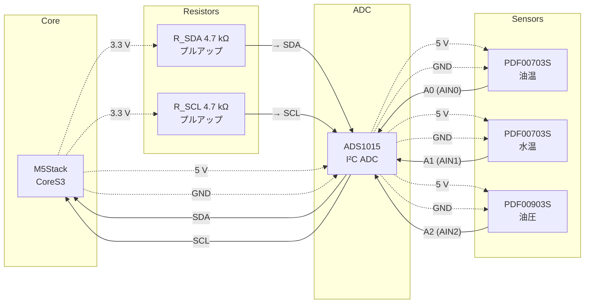

# 配線図 / Wiring Diagram

プルアップ抵抗は 4.7 kΩ とし、車載ノイズ対策しつつ 400 kHz I²C を確保します。
センサ電源は 5 V、I²C バスのプルアップは CoreS3 の 3.3 V を使用します。

```mermaid
graph LR
    %% === Devices ===
    subgraph Core
        CoreS3["M5Stack<br>CoreS3"]
    end
    subgraph ADC
        ADS1015["ADS1015<br>I²C&nbsp;ADC"]
    end
    subgraph Sensors
        OilTemp["PDF00703S<br>油温"]
        WaterTemp["PDF00703S<br>水温"]
        OilPress["PDF00903S<br>油圧"]
    end
    subgraph Resistors
        R_SDA["R_SDA 4.7 kΩ<br>プルアップ"]
        R_SCL["R_SCL 4.7 kΩ<br>プルアップ"]
    end

    %% === Analog ===
    OilTemp  -- "A0 (AIN0)" --> ADS1015
    WaterTemp -- "A1 (AIN1)" --> ADS1015
    OilPress -- "A2 (AIN2)" --> ADS1015

    %% === I²C ===
    ADS1015 -- "SDA" --> CoreS3
    ADS1015 -- "SCL" --> CoreS3

    R_SDA -- "→ SDA" --> ADS1015
    R_SCL -- "→ SCL" --> ADS1015
    CoreS3 -.->|3.3 V| R_SDA
    CoreS3 -.->|3.3 V| R_SCL

    %% === Power ===
    CoreS3 -.->|5 V| ADS1015
    CoreS3 -.->|GND| ADS1015
    ADS1015 -.->|5 V| OilTemp
    ADS1015 -.->|5 V| WaterTemp
    ADS1015 -.->|5 V| OilPress
    ADS1015 -.->|GND| OilTemp
    ADS1015 -.->|GND| WaterTemp
    ADS1015 -.->|GND| OilPress
```
